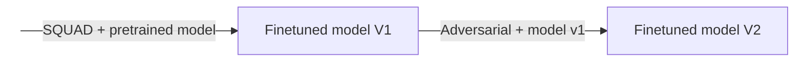

## Analysis 

### 1.  Adversarial datatse

### 2.  Checklist

---

## Fix 

Below are the results of some of the experiments 

### 1. Staged Finetuning

- In this method we fintune the pretrained model on SQUAD dataset, then record its metrics for both squad dataset and another adversarial dataset. Then we use this finetuned model into a second round of finetuning using only the adversarial dataset.
- This can be depicted as shown below:

- When we finetuned squad on electra model then finetuned this model on [adversarial datase](https://huggingface.co/datasets/UCLNLP/adversarial_qa/tree/main), we observed these results on :
    - SQUAD eval split

    | Metric | Finetuned V1 | Finetuned V2|
    |--------|----------|---------|
    |eval_exact_match |78.2|  68.8|
    |eval_f1 | 86.0 |  77.7 |

    - Avdersarial eval split

    | Metric | Finetuned V1 | Finetuned V2|
    |--------|----------|---------|
    |eval_exact_match | 18.6| 28.9 |
    |eval_f1 | 28.2| 39.0|

---
